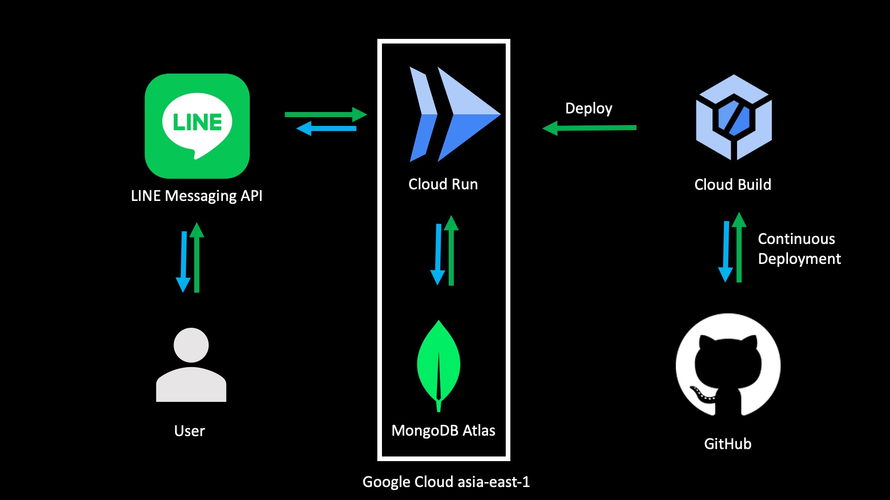

# foodmeow

## Demo

還在想要怎麼弄，我覺得開 Demo 大家一定會狂 call，免費的 Cloud Run 還是有呼叫次數限制的，會再想想辦法。

## Story

離開家裡過後我爸說要給我吃飯的錢當零用錢。他開了一個群組，要我每次報帳的時候打「上次累積的錢 + 這次的錢」，我覺得這個太麻煩了，所以寫了一個 bot 來算。

突然要我生一隻 bot 太困難了，所以我那時候就隨便改的一隻另外一個專案寫到一半的 bot，那個 code 超醜，醜到我都不想承認是我寫的。

除了 code 醜到超出我心裡可以接受的極限之外，我一個月要花 300 塊養一顆 MySQL 的 instance。後來發現 MongoDB Atlis 不用錢，所以決定把 code 重寫，然後把資料轉到 MongoDB Atlis 上。我自己沒有很喜歡 Heroku，後來發現 Cloud Run 這個東西超香的，目前程式跟機器都放在 Google Cloud 的 asis-east-1 上。  

## How to use

/* TODO */

## 功能

- 記帳
  - 新增食物帳款
  - 新增一般帳款
  - 未結總額
  - 刪除未結總額
  - 歷史資料
  - 退出、刪除暫存資料

## Contribute

歡迎加入新功能  
變數名稱跟寫法大家看得懂就好，開 PR 我都會看 ❤️

## Term of use

標明出處就可以了